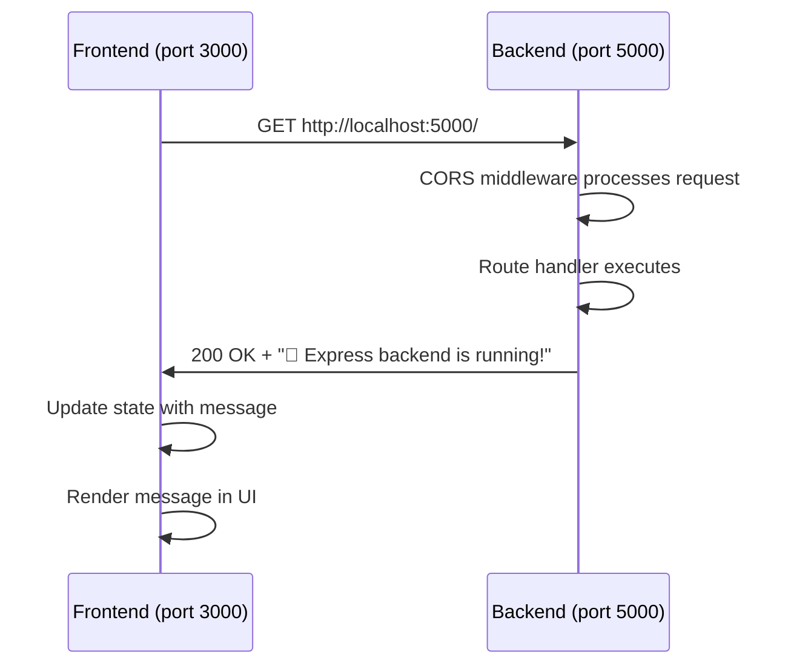

## Available Endpoints

The backend currently exposes one endpoint for health checking and basic connectivity testing.

## GET /

A simple health check endpoint that confirms the backend server is running and accessible.

### Endpoint Details

<ParamField path="/" type="GET">
  Root endpoint that returns a status message indicating the server is operational.
</ParamField>

### Implementation

```javascript index.js
app.get('/', (req, res) => {
  res.send('🚀 Express backend is running!');
});
```

<Note>
  This endpoint requires no authentication, parameters, or request body. It's designed to be a simple way to verify server connectivity.
</Note>

### Request

<Tabs>
  <Tab title="cURL">
    ```bash
    curl http://localhost:5000/
    ```
  </Tab>
  
  <Tab title="JavaScript Fetch">
    ```javascript
    fetch('http://localhost:5000/')
      .then(res => res.text())
      .then(data => console.log(data))
      .catch(err => console.error(err));
    ```
  </Tab>
  
  <Tab title="Browser">
    Simply navigate to:
    ```
    http://localhost:5000/
    ```
  </Tab>
</Tabs>

### Response

<ResponseField name="response" type="string">
  A plain text message confirming the server is operational.
  
  **Value**: `🚀 Express backend is running!`
</ResponseField>

#### Example Response

```text
🚀 Express backend is running!
```

<Accordion title="Response Headers">
  The response includes the following headers:
  
  - `Content-Type: text/html; charset=utf-8` - Indicates the response is plain text
  - `Access-Control-Allow-Origin: *` - CORS header allowing all origins (set by CORS middleware)
  - `Content-Length: 33` - Size of the response body in bytes
</Accordion>

### Status Codes

| Status Code | Description |
|-------------|-------------|
| `200 OK` | Server is running and responding normally |
| `500 Internal Server Error` | Server encountered an error (rare for this simple endpoint) |

## Frontend Integration

The frontend React application consumes this endpoint to verify backend connectivity.

### Frontend Code

Here's how the frontend calls this endpoint from `App.js`:

```javascript App.js
import { useEffect, useState } from "react";

function App() {
  const [message, setMessage] = useState("");

  useEffect(() => {
    fetch("http://localhost:5000/")
      .then((res) => res.text())
      .then((data) => setMessage(data))
      .catch((err) => console.error(err));
  }, []);

  return (
    <div style={{ textAlign: "center", marginTop: "50px" }}>
      <h1>Frontend Connected to Backend</h1>
      <h2>{message}</h2>
    </div>
  );
}

export default App;
```

### Integration Flow

<Steps>
  <Step title="Component Mounts">
    When the React component mounts, the `useEffect` hook triggers.
  </Step>
  
  <Step title="Fetch Request">
    The frontend sends a GET request to `http://localhost:5000/`.
  </Step>
  
  <Step title="CORS Processing">
    The backend's CORS middleware adds necessary headers to allow the cross-origin request.
  </Step>
  
  <Step title="Response Received">
    The backend sends back the message: `🚀 Express backend is running!`
  </Step>
  
  <Step title="State Update">
    The frontend converts the response to text and updates the `message` state.
  </Step>
  
  <Step title="UI Renders">
    The message is displayed in an `<h2>` element on the page.
  </Step>
</Steps>

### Request/Response Flow



## Testing the Endpoint

<Tabs>
  <Tab title="Manual Test">
    <Steps>
      <Step title="Start the backend">
        ```bash
        cd server
        node index.js
        ```
      </Step>
      
      <Step title="Open browser">
        Navigate to `http://localhost:5000/`
      </Step>
      
      <Step title="Verify response">
        You should see: `🚀 Express backend is running!`
      </Step>
    </Steps>
  </Tab>
  
  <Tab title="With Frontend">
    <Steps>
      <Step title="Start the backend">
        ```bash
        cd server
        node index.js
        ```
      </Step>
      
      <Step title="Start the frontend">
        In a separate terminal:
        ```bash
        cd client
        npm start
        ```
      </Step>
      
      <Step title="Check the UI">
        The React app should display the backend message in the center of the page.
      </Step>
    </Steps>
  </Tab>
  
  <Tab title="Command Line">
    Use cURL to test the endpoint:
    
    ```bash
    curl -i http://localhost:5000/
    ```
    
    Expected output:
    ```
    HTTP/1.1 200 OK
    Access-Control-Allow-Origin: *
    Content-Type: text/html; charset=utf-8
    Content-Length: 33
    
    🚀 Express backend is running!
    ```
  </Tab>
</Tabs>

<Warning>
  Make sure the backend server is running before testing. If you get a connection error, verify that:
  - The server is running (`node index.js`)
  - It's listening on the correct port (default: 5000)
  - No firewall is blocking the connection
</Warning>

## Common Issues

<AccordionGroup>
  <Accordion title="CORS Error in Browser">
    **Problem**: Browser console shows CORS error
    
    **Solution**: Ensure the CORS middleware is properly configured in `index.js`:
    ```javascript
    app.use(cors());
    ```
    
    This line must appear **before** your route handlers.
  </Accordion>
  
  <Accordion title="Connection Refused">
    **Problem**: `fetch` fails with "Connection refused"
    
    **Solution**: 
    - Verify the backend server is running
    - Check that you're using the correct port (5000 by default)
    - Ensure no other application is using port 5000
  </Accordion>
  
  <Accordion title="Wrong Port in Frontend">
    **Problem**: Frontend can't connect to backend
    
    **Solution**: Verify the fetch URL in `App.js` matches your server port:
    ```javascript
    fetch("http://localhost:5000/") // Port must match server
    ```
  </Accordion>
</AccordionGroup>

## Next Steps

<CardGroup cols={2}>
  <Card title="Add More Endpoints" icon="plus">
    Expand your API by adding additional routes for different functionality.
  </Card>
  
  <Card title="Add Request Body Parsing" icon="file-code">
    Use `express.json()` middleware to handle JSON request bodies for POST/PUT requests.
  </Card>
  
  <Card title="Connect a Database" icon="database">
    Integrate MongoDB, PostgreSQL, or another database to persist data.
  </Card>
  
  <Card title="Add Authentication" icon="lock">
    Implement JWT or session-based authentication to secure your endpoints.
  </Card>
</CardGroup>