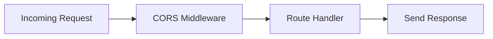

## Complete Server Code

Here's the complete `index.js` file that powers the backend:

```javascript index.js
const express = require('express');
const cors = require('cors');
const app = express();

app.use(cors());

app.get('/', (req, res) => {
  res.send('🚀 Express backend is running!');
});

const PORT = process.env.PORT || 5000;
app.listen(PORT, () => console.log(`✅ Server running on port ${PORT}`));
```

## Code Breakdown

Let's examine each part of the server configuration:

### 1. Express App Initialization

```javascript
const express = require('express');
const app = express();
```

<Steps>
  <Step title="Import Express">
    The `express` module is imported using Node.js's `require()` function.
  </Step>
  
  <Step title="Create Application Instance">
    Calling `express()` creates a new Express application instance stored in the `app` variable. This instance represents your web server and provides methods for routing, middleware, and configuration.
  </Step>
</Steps>

### 2. CORS Middleware Configuration

```javascript
const cors = require('cors');
app.use(cors());
```

<Note>
  **What is CORS?** Cross-Origin Resource Sharing (CORS) is a security feature that controls which domains can access your API. Without CORS middleware, browsers block requests from different origins.
</Note>

The `app.use(cors())` call enables CORS with default settings, which:

- Allows requests from **any origin** (domain)
- Permits all standard HTTP methods (GET, POST, PUT, DELETE, etc.)
- Allows all headers

<Tabs>
  <Tab title="Development Mode">
    The current configuration is perfect for development:
    
    ```javascript
    app.use(cors());
    ```
    
    This allows your frontend (typically running on `http://localhost:3000`) to communicate with your backend (running on `http://localhost:5000`).
  </Tab>
  
  <Tab title="Production Mode">
    For production, you should restrict CORS to specific origins:
    
    ```javascript
    app.use(cors({
      origin: 'https://yourdomain.com',
      credentials: true
    }));
    ```
  </Tab>
</Tabs>

<Warning>
  In production, never use `cors()` with default settings. Always specify allowed origins to prevent unauthorized access to your API.
</Warning>

### 3. Server Listen Setup

```javascript
const PORT = process.env.PORT || 5000;
app.listen(PORT, () => console.log(`✅ Server running on port ${PORT}`));
```

This code does three things:

1. **Determines the Port**: Uses the `PORT` environment variable if available, otherwise defaults to `5000`
2. **Starts the Server**: `app.listen()` binds the server to the specified port
3. **Logs Confirmation**: The callback function logs a success message when the server starts

### 4. Console Output

When you run `node index.js`, you'll see:

```bash
✅ Server running on port 5000
```

This confirms that:
- The server started successfully
- It's listening for requests on the specified port
- No errors occurred during initialization

<Note>
  If you see an error like `EADDRINUSE`, it means the port is already in use. Try a different port using the `PORT` environment variable.
</Note>

## Running the Server

<Steps>
  <Step title="Navigate to server directory">
    ```bash
    cd server
    ```
  </Step>
  
  <Step title="Start the server">
    ```bash
    node index.js
    ```
  </Step>
  
  <Step title="Verify it's running">
    Look for the console message:
    ```
    ✅ Server running on port 5000
    ```
  </Step>
  
  <Step title="Test the server">
    Open your browser and navigate to `http://localhost:5000/` to see the server response.
  </Step>
</Steps>

## Middleware Flow

Here's how a request flows through the server:



1. A request arrives at the server
2. CORS middleware processes it first, adding appropriate headers
3. The request is matched to a route handler
4. The handler sends a response back to the client

## Next Steps

Now that you understand the server configuration, learn about the [API endpoints](/backend/api) your backend exposes.